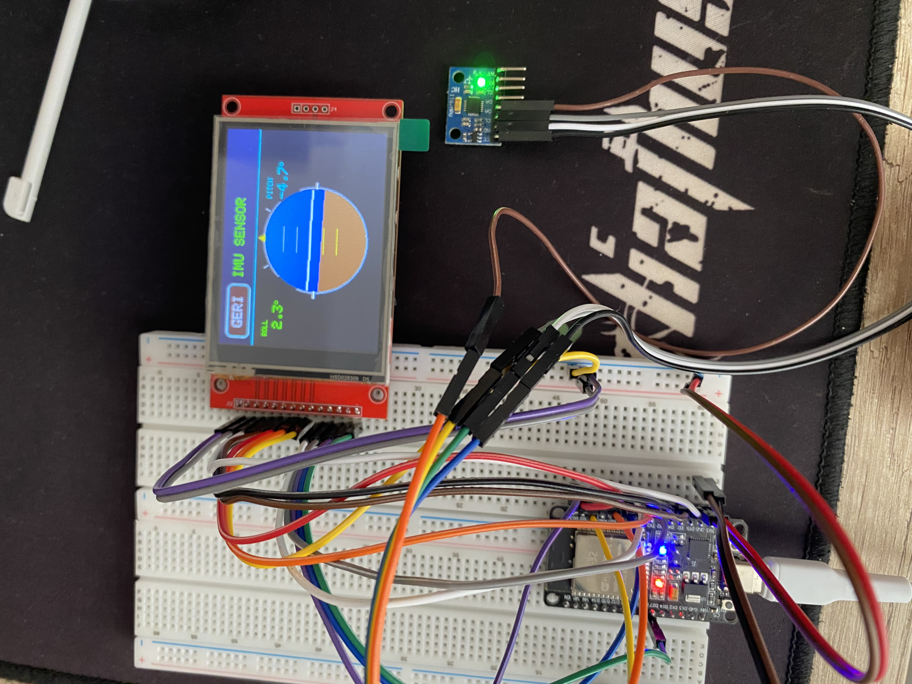

# ESP32-MPU6050-HorizonDisplay

## Overview
This project is a real-time flight horizon indicator using **ESP32**, **MPU6050 IMU**, and a **TFT touch display**. The system reads accelerometer and gyroscope data from the MPU6050 sensor, processes it on the ESP32, and visualizes roll and pitch angles on the TFT in real-time.

## Features
- Real-time IMU data visualization.
- Smooth and stable horizon display with aircraft symbol.
- Roll and pitch digital readouts displayed alongside the horizon.
- Touchscreen interface to navigate between menu and IMU display.
- Calibration of touchscreen for accurate interaction.
- Low-latency updates using optimized drawing routines for TFT.

## Hardware
- ESP32 Dev Module
- MPU6050 IMU
- ILI9341 TFT Touch Display
- SPI and I2C connections for communication

### Pin Configuration
**TFT Display**
- CS → 15  
- DC → 2  
- RST → 4  

**Touch**
- CS → 5  
- IRQ → 27  

**IMU**
- SDA → 21  
- SCL → 22  

**SPI Defaults**
- SCK → 18  
- MISO → 19  
- MOSI → 23

## Software
- PlatformIO + Arduino Framework
- Libraries:
  - `MPU6050`
  - `Adafruit_GFX`
  - `Adafruit_ILI9341`
  - `XPT2046_Touchscreen`

## Usage
1. Clone the repository.  
2. Open in PlatformIO.  
3. Verify touchscreen calibration values (`X_MIN`, `X_MAX`, `Y_MIN`, `Y_MAX`) for your display.  
4. Upload the code to the ESP32.  
5. Observe real-time roll and pitch values on the horizon display. Move the sensor to see the aircraft symbol and horizon react dynamically.

## Notes
- The horizon display is optimized to avoid flickering while maintaining smooth updates.  
- Roll and pitch digital readouts are updated at a slightly slower rate for readability.  

---

📌 For more details and source code, check the repository [here](YOUR_GITHUB_LINK_HERE)
